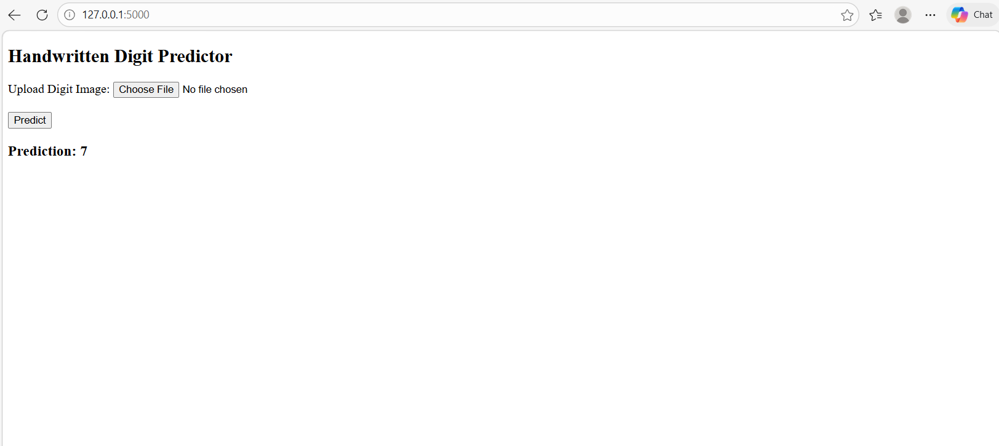

# Handwritten Digit Predictor

## 📌 Project Description
This is a Deep Learning project that predicts handwritten digits using the MNIST dataset.

## 🚀 Technologies Used
- Python
- TensorFlow / Keras
- Flask
- HTML
- VS Code

## ⚙️ How to Run
pip install -r requirements.txt
python model.py
python app.py

## Example Output
Model predicts handwritten digit correctly

